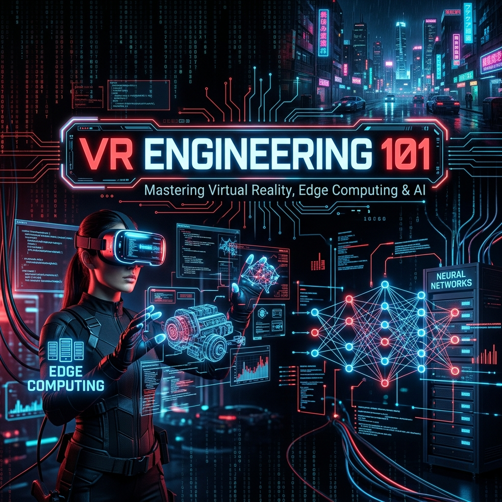

<p align="center">
  
</p>

# 🌌 Sanal Gerçeklik Mühendisliği 101: Epistemik ve Otonom Sistemler (VR Engineering 101)

[](#)
[](#)
[](#)
[](https://opensource.org/licenses/MIT)

> Dijital kodun fiziksel donanımla buluştuğu noktada, sürükleyici (immersive) sistemlerin mimarisini sıfırdan anlamak ve otonom/etkileşimli ortamlar inşa etmek için hazırlanan açık kaynaklı araştırma ve geliştirme rehberi.

---

## 🔭 Vizyon Köşesi

**"Gerçeklik, beynimizin elektrik sinyallerine verdiği bir tepkiden ibaretse, bu sinyalleri mühendislikle ne kadar bükebiliriz?"**

Bizler sanal gerçekliği (VR) yalnızca eğlence odaklı bir son kullanıcı deneyimi veya oyun oynamak için tasarlanmış bir araç olarak görmüyoruz. Aksine, **insan algısının sınırlarını zorlayan, makinelerin dünyayı nasıl anladığını test eden ve fizik kurallarını dijital ortamda yeniden yazmamızı sağlayan bir bilim dalı** olarak ele alıyoruz. 

Bu havuzda, salt kod yazmanın ötesine geçerek; sensörlerin nasıl kandırılabileceğini, yapay zekanın görüntü işlemedeki devrimini ve bir makinenin "görme" eylemini milisaniyeler içinde nasıl gerçekleştirdiğini **Meta-Mühendislik** yaklaşımıyla inceleyeceğiz. Amacımız sadece VR donanımını kullanmak değil, bu donanımın ruhunu, matematiğini ve sınırlarını keşfetmektir.

---

Sanal gerçeklik (VR) sistemlerini yalnızca eğlence odaklı bir son kullanıcı deneyimi olarak görmüyoruz. Bu depo; uçta işleme (edge computing), sensör füzyonu, düşük gecikmeli sistem mimarisi ve **Epistemik Teknoloji Felsefesi** çerçevesinde, makinelerin "gerçekliği" nasıl algıladığını ve işlediğini inceleyen bağımsız araştırmacılar (autodidact) için bir yol haritasıdır.

Amacımız: Salt manuel kodlamadan çıkarak, donanım seviyesinde sorun gidermeyi ve algoritmik verimliliği merkeze alan **Meta-Mühendislik** yaklaşımını VR teknolojilerine uygulamaktır.

---

## 🧠 Epistemik Sistem Tasarımı

Bir VR başlığının (HMD) içindeki ivmeölçer dünyanın yerçekimini nasıl "biliyor"? Sanal uzaydaki bir objenin varlığı (ontolojisi), işlemcideki bellek adreslerinden mi ibarettir? 
Sistem mimarimizi kurarken bilginin doğruluğunu, sensör verisinin gürültüden arındırılmasını ve dijital ikizlerin (digital twins) fiziksel dünyayla olan senkronizasyonunu sorguluyoruz.

---

## 🏗️ Modüller ve Araştırma Odakları

### Modül 1: Donanım Mimarisi ve Sensör Füzyonu
Cihazların dünyayı algılamasını sağlayan donanım bileşenleri ve sinyal işleme temelleri.
*   **HMD Temelleri:** Optik lens tasarımları, ekran tazeleme hızları, görüş alanı (FOV) ve donanımsal darboğazlar.
*   **Gürültü Filtreleme (Kalman Filtresi):** IMU (İvmeölçer, Jiroskop, Manyetometre) verilerini birleştirerek kesin yönelim hesaplaması. Sürekli güncellenen durum kestirimi için Kalman Kazancı şu şekilde hesaplanır:
    $$ K_k = P_{k|k-1} H^T (H P_{k|k-1} H^T + R)^{-1} $$
*   **Uzamsal Matematik:** 3B dönüşümlerde Gimbal Lock probleminden kaçınmak için Euler açıları yerine Kuaterniyon (Quaternion) kullanımı:
    $$ q' = q \otimes p \otimes q^{-1} $$

### Modül 2: Edge-AI Optimizasyonu (On-Premise İşleme)
Buluta bağımlı kalmadan, VR gözlüğünün veya yerel donanımın kendi kısıtlı kaynaklarıyla yapay zeka modellerini çalıştırma sanatı.
*   **Model Pruning (Budama) & Kuantizasyon:** Göz takibi (eye-tracking) ve el hareketleri tahmini için kullanılan büyük modellerin (FP32'den INT8'e) uç cihazlar için optimize edilmesi.
*   **Knowledge Distillation:** Öğretmen-öğrenci model mimarileriyle minimum gecikme (latency) elde edilmesi.
*   **Foveated Rendering:** GPU kaynaklarını yalnızca kullanıcının odaklandığı piksellere yönlendiren makine öğrenmesi destekli render teknikleri.

### Modül 3: Otonom Sistemler ve ROS2 Entegrasyonu
Sanal gerçekliğin robotik ve fiziksel sistemlerle haberleşmesi.
*   **Dijital İkiz (Digital Twin):** Gerçek dünyadaki bir donanımın (örneğin bir mini-torna makinesi veya otonom aracın) VR içindeki eşzamanlı kopyası.
*   **Haberleşme:** ROS2 (Robot Operating System) node'ları ile oyun motoru (C++ API) arasında düşük gecikmeli veri akışı.

### Modül 4: Security by Design (Tasarım Odaklı Güvenlik)
Siber güvenlik ilkelerinin doğrudan sistemin çekirdeğine gömülmesi.
*   **Telekomünikasyon Güvenliği:** Çok oyunculu/çoklu katılımcılı VR ağlarında UDP paket manipülasyonunu (spoofing) engelleme.
*   **SIEM Entegrasyonu:** VR ağındaki anormalliklerin ve izinsiz veri erişimlerinin loglanması ve sızma testi (penetration testing) pratikleri.

---

## 💻 Teknolojik Cephanelik (Technical Arsenal)

Bağımsız ve tek kişilik (solopreneur/individual contributor) geliştirme süreçlerinde maksimum verim için seçilmiş teknoloji yığını:

*   **Core / Render:** `C++ (17/20)` - Doğrudan bellek yönetimi, multithreading ve minimum "Motion-to-Photon" gecikmesi için.
*   **AI / Edge Computation:** `Python 3.x`, `PyTorch`, `TensorFlow` - Model eğitimi, budama ve kuantizasyon testleri.
*   **Simülasyon / Fizik:** `ROS2` - Otonom donanım entegrasyonları.

---

## 🚀 "Build in Public" Yol Haritası

Projeyi kapalı kapılar ardında değil, şeffaf bir üretim süreciyle inşa ediyoruz.

*   **[Faz 1]** Sensör verilerinin C++ ile işlenmesi ve temel motor mimarisinin kurulması.
*   **[Faz 2]** Edge-AI destekli objelerin ve foveated rendering prototipinin entegrasyonu.
*   **[Faz 3]** ROS2 ile fiziksel donanımların sanal dünyaya bağlanması ve ağ güvenliği testleri.

---

## ⚙️ Başlangıç

1.  Repoyu klonlayın:
```bash
    git clone [https://github.com/kullaniciadi/vr-engineering-101.git](https://github.com/kullaniciadi/vr-engineering-101.git)
    cd vr-engineering-101
    ```
2.  `architecture_docs/` klasöründeki epistemik tasarım prensiplerini okuyun.
3.  Kurulum komut dosyalarını çalıştırarak ortamınızı hazırlayın.

> *"Mühendislik sadece bir şeyler inşa etmek değil, inşa edilenin sınırlarını ve doğasını bilmektir."*

```

---