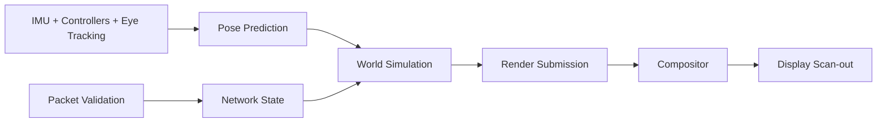

# Sistem Mimarisi Notlari

VR runtime dusunurken tek bir "render motoru" degil, zaman hassasiyetli bir veri
akisi tasarlaniyor.

## Kritik Sorular

- Sensor zaman damgasi hangi saat kaynagina gore tutuluyor?
- Pose prediction kac milisaniye ileriye bakiyor?
- Render thread ile simulation thread arasinda hangi veri sahipligi kurali var?
- Agdan gelen state, yerel tahmini ne zaman ve nasil duzeltiyor?
- Mahrem veriler loglanmadan once maskeleme veya azaltma uygulaniyor mu?

## Ilk Tasarim Hedefleri

| Alan | Hedef |
| --- | --- |
| Motion-to-photon | 20 ms altinda kalmak |
| Frame pacing | 90 Hz icin 11.1 ms frame butcesini izlemek |
| Paket dogrulama | Monoton sequence ve HMAC kontrolu |
| Sensor fuzyonu | Drift'i sinirlayan tahmin modeli |
| Dokumantasyon | Her varsayimi olculebilir ifade etmek |
